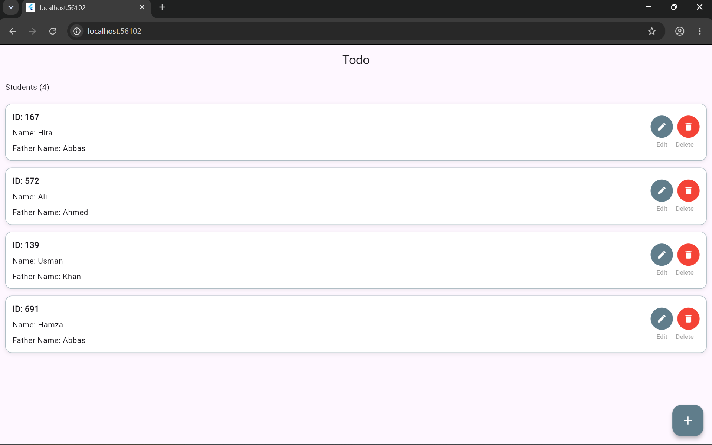
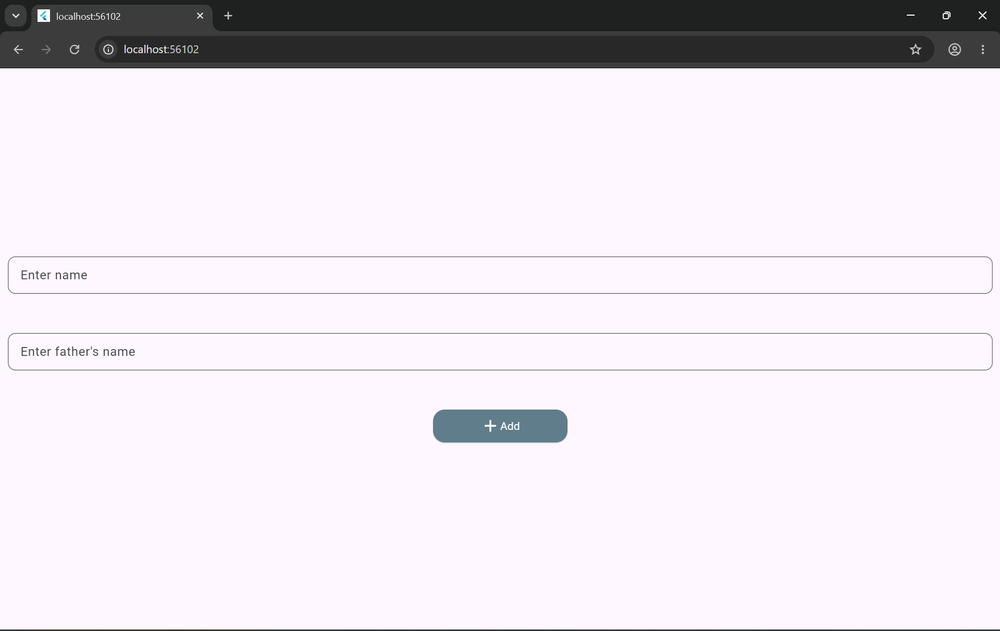
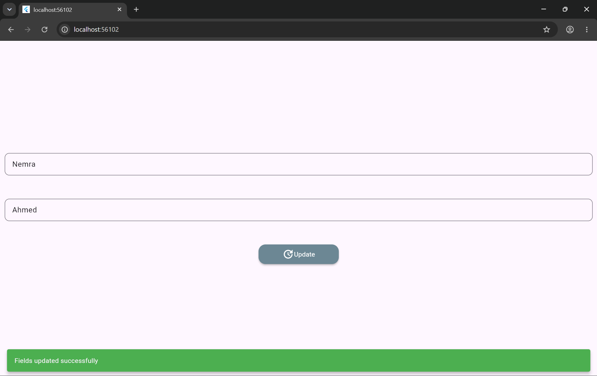

# 📝 Todo UI App (Student Manager)

A simple Flutter application to manage student records. Users can perform CRUD operations (add, view, edit, and delete) on students through a clean and reusable UI.

## ✨ Features

- 📋 View students list with live count
- ➕ Add a new student
- ✏️ Edit an existing student
- 🗑️ Delete a student
- ✅ Snackbar messages for validation and successful update

## 📸 Screenshots

| Home                          | Add                         | Edit                          |
| ----------------------------- | --------------------------- | ----------------------------- |
|  |  |  |

## 🧠 What I Learned

- **Widgets & layout:** `Scaffold`, `Container`, `Row`, `Column`, `Expanded`, `BoxDecoration`
- **Lists:** `ListView.builder`, string interpolation
- **State:** `StatefulWidget` and `setState`
- **List operations:** `add`, `removeAt`, `indexWhere`
- **Navigation:** `Navigator.push` / `pop`, passing data forward and returning data back
- **Async:** `async` / `await`, `Future.delayed`, `mounted` check
- **Forms:** `TextEditingController`, `initState`, `SnackBar`
- **Dart:** classes, `required` named parameters, nullable types, initializer list, `const`
- **Reusable widgets:** `CustomButton`, `CustomTextField`

## 🚀 Run the Project

```
git clone https://github.com/HiraAbbas/ToDo_App_Flutter_Project_AsheriTech.git
cd ToDo_App_Flutter_Project_AsheriTech
flutter pub get
flutter run
```

## 👩‍💻 Author

Made with 💙 by **Hira Abbas** while learning Flutter.
